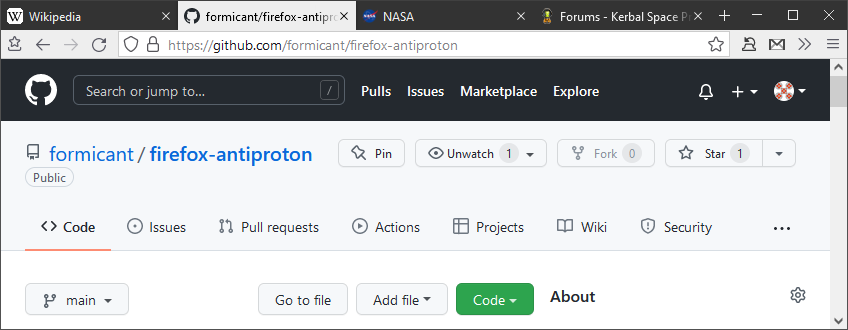

# firefox-antiproton

My personal style sheet for the Firefox UI

## How to install

- `about:config` → toolkit.legacyUserProfileCustomizations.stylesheets: **true**
- `about:support` → Profile Folder → Open Folder
  - in this folder, create a new folder named `chrome`
  - place the `userChrome.css` file into it
- Restart Firefox

## Debugging with live preview

- DevTools (`F12`) → Settings (`F1`) → Advanced settings →
  - enable browser chrome and add-on debugging toolboxes
  - enable remote debugging
- Remote debugging (`Ctrl+Alt+Shift+I`)
  - OK
- Style Editor tab → `userChrome.css` file
- To debug popup menu: `…` button → Disable Popup Auto-Hide
